🔥🔥🔥🔥🔥🔥🔥🔥🔥🔥

**Mục lục**
   - [ **Phần 1: Microservices**]()
   - [ **Phần 2 : Tracing  (có thể bỏ qua phần này)**]()
   - [ **Phần 3 : Run docker microservices**]()

🔥🔥🔥🔥🔥🔥🔥🔥🔥🔥

[ **Phần 1: Microservices**]()

Check các service đã đăng kí trên Eureka(localhost:8761)
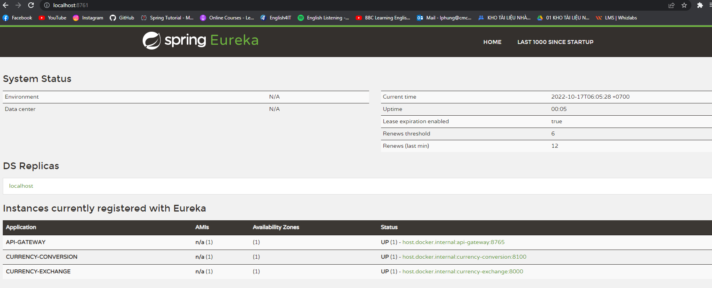

2. Tạo một Service "naming server", Sau đó dùng FeinClients để gọi service khác:

3. Tạo API Gateway (PORT 8765) có tác dụng điều hướng request tới các service

    Conversion:
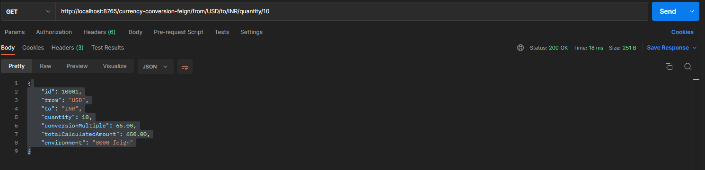

    Exchange:
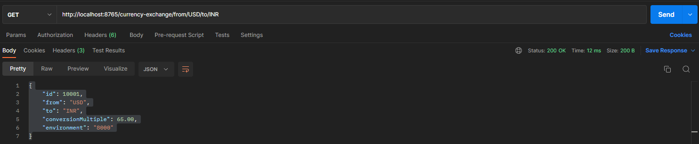

Database: File data.sql

----------------------------------------------------------------------------------------------------------

[ **Phần 2 : Tracing  (có thể bỏ qua phần này)**]()

Trong quá trình phát triển và vận hành một hệ thống, để giải quyết các vấn đề phát sinh,ta thường phải theo dõi 
flow của các request trong hệ thống. Flow của một request được bắt đầu kể từ khi hệ thống tiếp nhận request và kết thúc
khi hệ thống không còn xử lý request này nữa. Kỹ thuật này được gọi với thuật ngữ là tracing.

Thông qua distributed tracing, chúng ta có thể theo dõi được flow của một request dễ dàng hơn: xác định được tổng thời 
gian để hệ thống xử lý request đó, hoặc biết được request gặp vấn đề ở service nào.

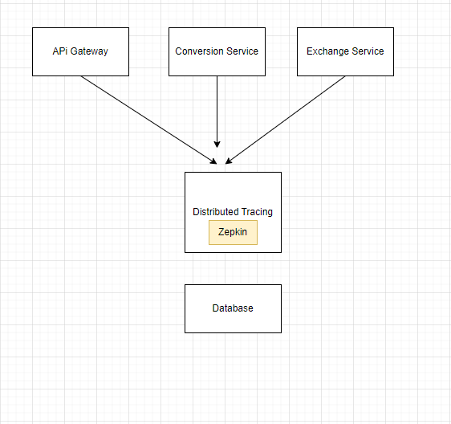

Zipkin là một hệ thống distributed tracing open source. Chạy zipkin docker : `docker run -p 9411:9411 openzipkin/zipkin:latest`

Chạy zipkin: localhost:9411

Sau đó connect các service với zipkin bằng cách sau:

Thêm các dependency sau vào các file pom của services: conversion, exchange, naming-server, api-gateway
      
       <dependency>
            <groupId>org.springframework.cloud</groupId>
            <artifactId>spring-cloud-starter-sleuth</artifactId>
        </dependency>

        <dependency>
            <groupId>org.springframework.cloud</groupId>
            <artifactId>spring-cloud-sleuth-zipkin</artifactId>
        </dependency>

Trace được các request trên giao diện zipkin như hình:
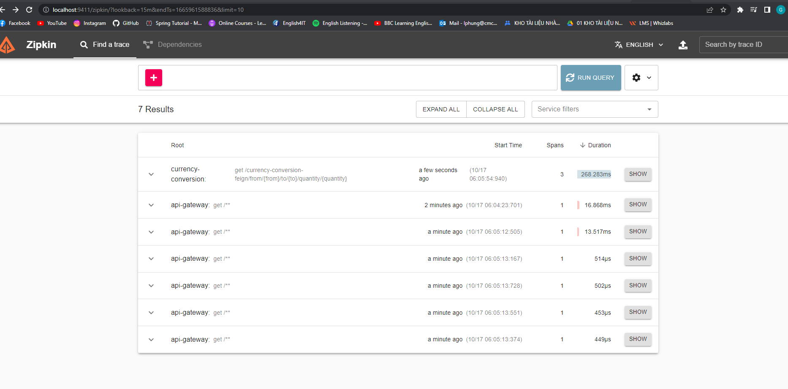

------------------------------------------------------------------------------------------------------------------------
[**Phần 3 : Run docker microservices**]()
Lưu ý : Phần này không dùng docker compose, Run container theo cách dễ hiểu

1. **Tạo network**

   `docker network create microservice_network`

2. **Mysql service**

    - Pull images mysql : `docker pull mysql:5.7`
    - Run container từ images vừa pull: 
   `docker run --name mysql-instance -v /tmp/mysql-data:/var/lib/mysql -e MYSQL_ROOT_PASSWORD=dummypassword -e MYSQL_DATABASE=db-exchange-service -e MYSQL_USER=hunglp -e MYSQL_PASSWORD=dummypassword --network microservice_network -p 3306:3306 -it mysql:5.7`
    - Kết quả: 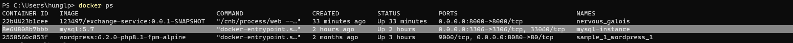
    - Truy cập vào container mysql : `docker exec -it mysql-instance bash -l`
    - Đăng nhập mysql instance bằng lệnh :  `mysql -uroot -pdummypassword`
    - hiển thị list databases : `show databases;`
    - Sử dụng schema : `use db-exchange-service;`
    - Show tables cuar schema: `show tables;`
    - Execute các câu query ở file [data.sql](images/data.sql):  

3. **Naming service**
   - Sửa file pom ( trong naming-server) thành như sau :
   - !images/[img_15.png](images/img_15.png)
   - cd đến thư mục naming-server, Chạy lệnh sau để build images `./mvnw spring-boot:build-image -DskipTests`
   - Kết quả: 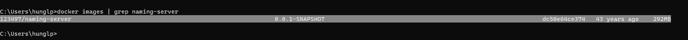
   - Run container từ images vừa build: `docker run -p 8761:8761 123497/naming-server:0.0.1-SNAPSHOT --name=naming-instance --network microservice_network `
   - Kết quả: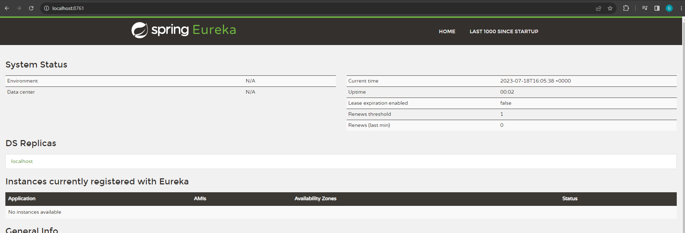

4. **Exchange-Service:**
    - Thêm vào file pom.xml như sau:
    - 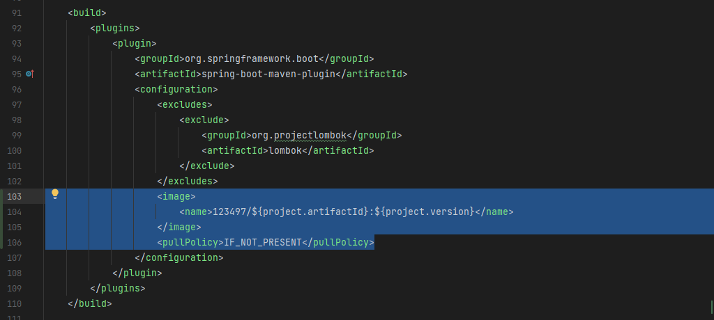
    - Apply config cho docker (Path DB và Path join tới naming server)
    - 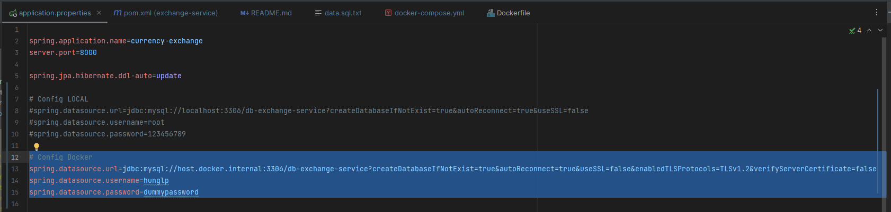
    - 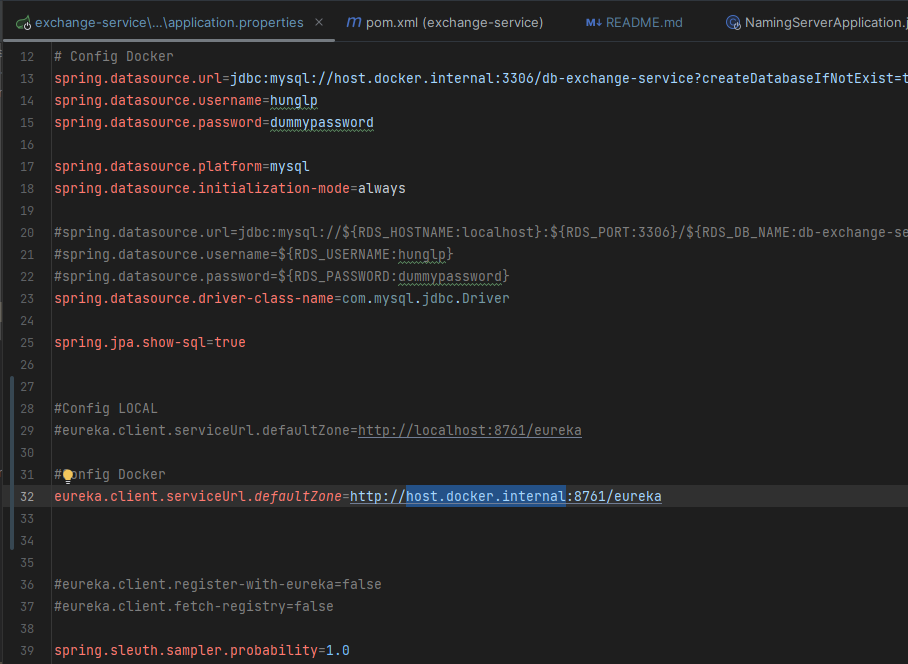
    - cd tới thư mục exchange-services
    - Run lệnh sau để build images bằng maven: `./mvnw spring-boot:build-image -DskipTests`
    - Kiểm tra images vừa build: : `docker images | grep exchange-service`
    - Kết quả : 
    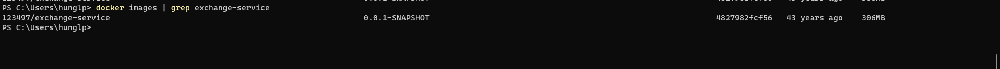
    - Run container exchange-service : `docker run -p 8000:8000 123497/exchange-service:0.0.1-SNAPSHOT --name=exchange-instance --network microservice_network -d mysql-instance`
    - ---------------------------------- Xong -------
    - Kết quả :
    - 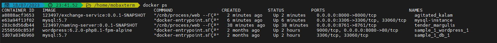
    - 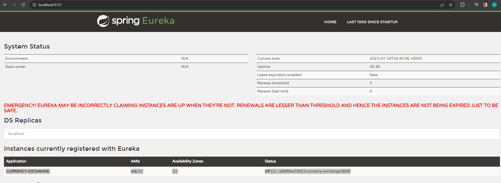 
    - 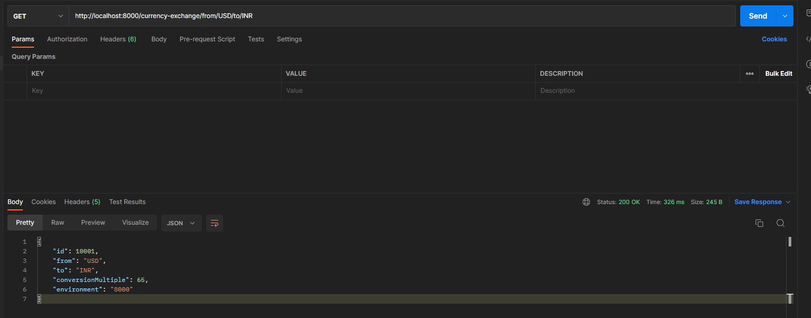

5. **Conversion-Service:**
   - Thêm vào file pom.xml như sau:
   - 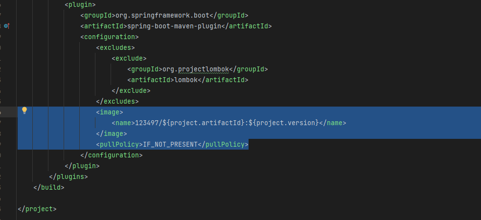
   - Apply config cho docker(Path join tới naming sever và url api call sang exchange service) :
   - 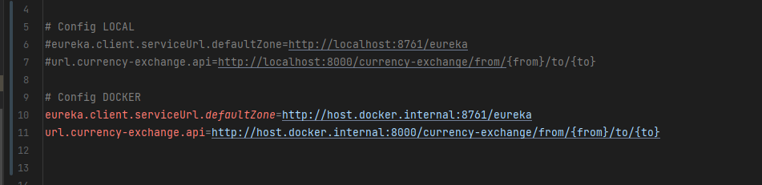
   - cd tới thư mục conversion-serrvice
   - Build images : `./mvnw spring-boot:build-image -DskipTests`(Thường lần 1 sẽ lỗi, chạy lại lệnh này lần 2 là đươ :v)
   - Kết quả: 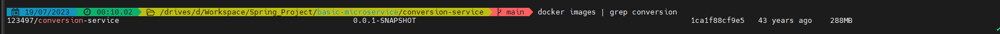
   - Run container conversion-service: `docker run -p 8100:8100 123497/conversion-service:0.0.1-SNAPSHOT --name=conversion-instance --network microservice_network`
   - Kết quả:
   - 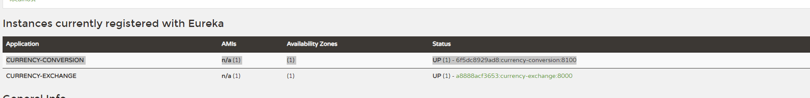
   

6. **API Gateway**
   - Build như các service trên
   - `./mvnw spring-boot:build-image -DskipTests`
   - `docker run -p 8765:8765 123497/api-gateway:0.0.1-SNAPSHOT --name=api-gateway --network microservice_network`

==> Tổng kết:
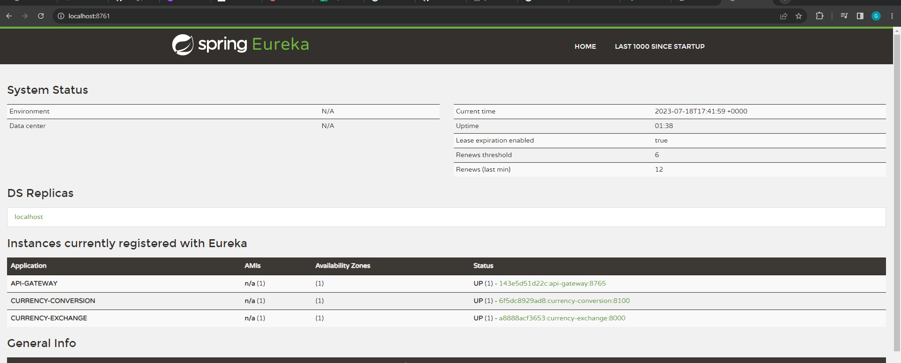

------------------------------------------------------------------------------------------------------------------------
[**Phần 4 : Run docker microservices với Docker compose**]()
1.  Tạo file docker-compose.yaml trong folder lớn của project
   - Config như sau: 
      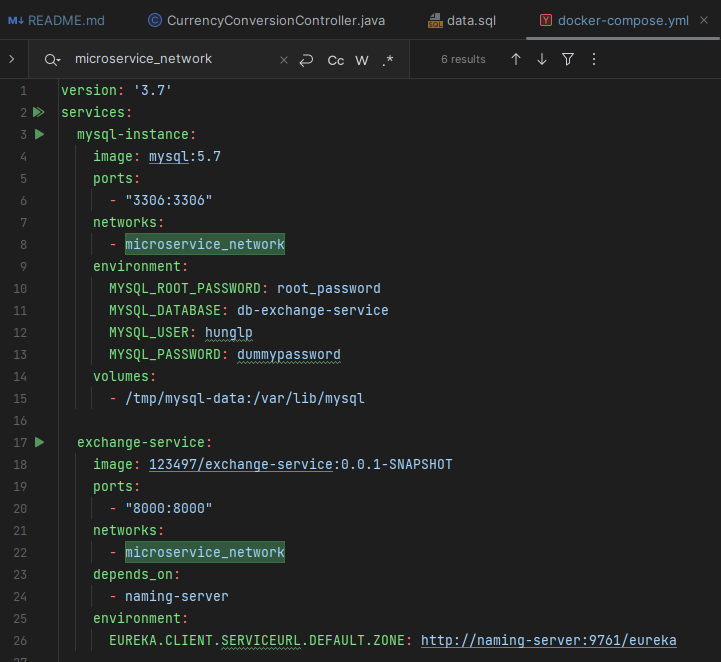
      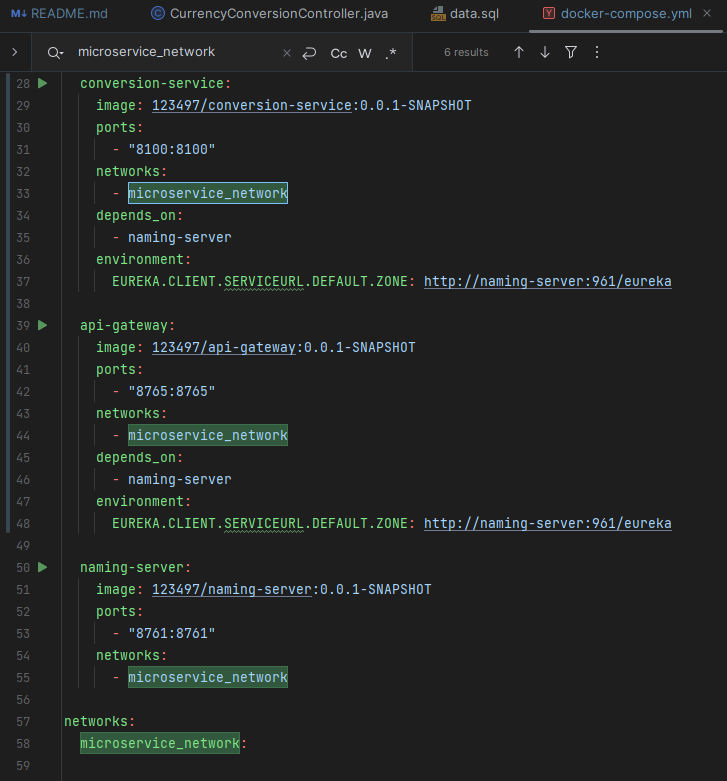
  

2. Run docker containers
   - cd tới folder basic-microservice
   - Run lệnh : `docker-compose up`
   

3. Kết quả:
   - 

   - 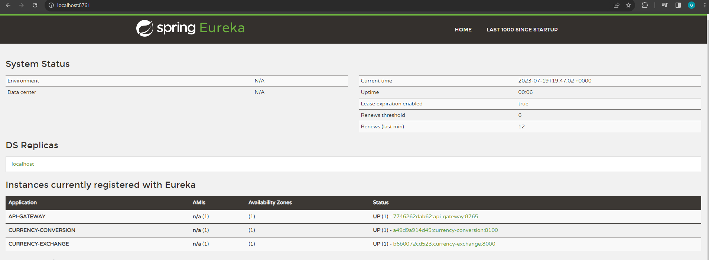
   - Gọi internal API trong exchange-service
   
   - Gọi exchange api thoong qua naming-server
   - 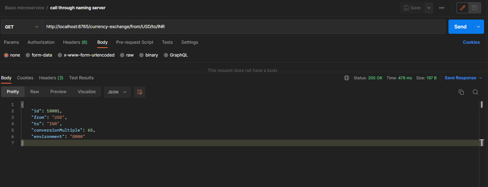
   - Gọi microservices thông qua rest api:
   - 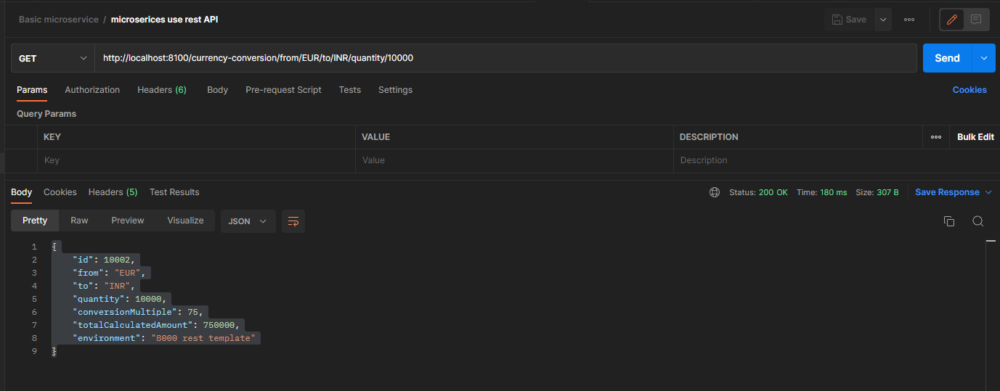
   - Gọi microservies thông qua fein client
   - 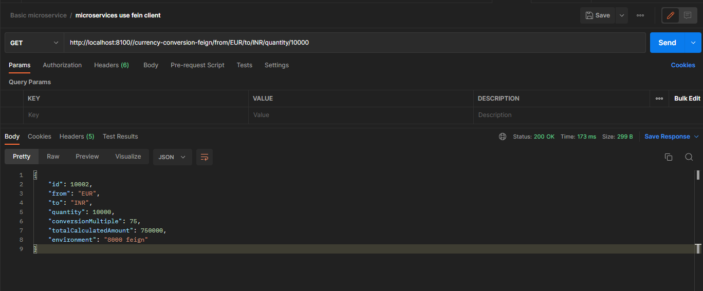

Xong.

------------------------------------------------------------------------------------------------------------------------
[**Phần 5 : Kubernetes với Microservices**]()

_**Lưu ý : Code thực hành sẽ ở branch: kubernetes và sẽ chỉ thực hành 2 service : conversion-service và exchange-service**_

1. Build lại images (version là 0.0.2-SNAPSHOT)
   - build images bằng lệnh : `./mvnw spring-boot:build-image -DskipTests`
   - Kết quả : 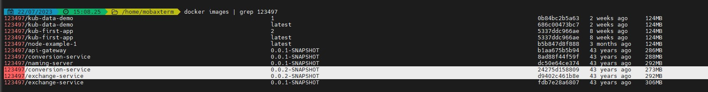

2. Push images lên dockerhub
   - `docker push 123497/exchange-service:0.0.2-SNAPSHOT`
   - `docker push 123497/conversion-service:0.0.2-SNAPSHOT`
   - Kết quả : 
   - 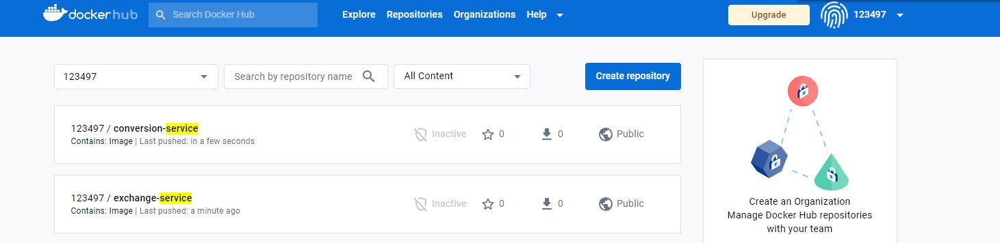

3. Tạo deployments và expose service
   - Mysql service: 
      + `cd k8s/database`
      + `kubectl apply -f=mysql-pvc.yml -f=mysql-pv.yml -f=mysql-deploy.yml -f=mysql-service.yml`
   - Exchange-service:
      + `cd k8s/exchange`
      + `kubectl apply -f=exchange-deploy.yml -f=exchange-service.yml`
   - Conversion-service
      + `cd k8s/conversion`
      + `kubectl apply -f=conversion-deploy.yml -f=conversion-service.yml`

4.  Expose các service
   - Expose mysql(Run cmd administrator) : `minikube service mysqldb`
      + Get pods : `kubectl get pod`
      + Truy cập vào mysql của pods bằng lệnh: `kubectl exec --stdin --tty mysql-deploy-759d8869bc-rmqr4 -- /bin/bash` (mysql-deploy-759d8869bc-rmqr4 là tên của pod)
      + Login mysql : `mysql -uroot -pPassword123`
      + Set quyền cho các user : `GRANT ALL PRIVILEGES ON *.* TO 'root'@'%';` 
      + Apply : `FLUSH PRIVILEGES;`
   -  Expose currency exchange(Run cmd administator) : `minikube service currenyc-`
   -  Ex
      + 

      https://stackoverflow.com/questions/2983248/com-mysql-jdbc-exceptions-jdbc4-communicationsexception-communications-link-fai/2985169#2985169
