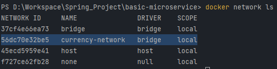

# MICROSERVICES 

**Phần 1. Microservices**

Check các service đã đăng kí trên Eureka(localhost:8761)

2. Tạo một Service "naming server", Sau đó dùng FeinClients để gọi service khác:

3. Tạo API Gateway (PORT 8765) có tác dụng điều hướng request tới các service

    Conversion:

    Exchange:

Database: File data.sql

------------------------------------------------------------------------------------------------------------------------
**Phần 2 : Run docker microservices**

2.1
- Bước 1 : Cd tới từng services rồi chạy lệnh `mvn clean package`
- Bước 2 : Cd tới folder basic-microservife, Tạo network bằng lệnh  `docker network create currency-network`
  (Ở đây _currency-network_ là tên network muốn đặt)
  Kiểm tra kết quả : `docker network ls`
        
  - Bước 3 : Docker Run file jar của của từng service trên network vừa tạo
      `docker run -p 8000:8000 --network=currency-network --name=exchange-service exchange-service/target/exchange-service-0.0.1-SNAPSHOT.jar`
      `docker run -p 8100:8100 --network=currency-network --name=conversion-service conversion-service-0.0.1-SNAPSHOT.jar`
      `docker run -p 8761:8761 --name naming-server --network currency-network naming-server-0.0.1-SNAPSHOT.jar`

------------------------------------------------------------------------------------------------------------------------
**Phần 3 : Tracing** 

Trong quá trình phát triển và vận hành một hệ thống, để giải quyết các vấn đề phát sinh,ta thường phải theo dõi 
flow của các request trong hệ thống. Flow của một request được bắt đầu kể từ khi hệ thống tiếp nhận request và kết thúc
khi hệ thống không còn xử lý request này nữa. Kỹ thuật này được gọi với thuật ngữ là tracing.

Thông qua distributed tracing, chúng ta có thể theo dõi được flow của một request dễ dàng hơn: xác định được tổng thời 
gian để hệ thống xử lý request đó, hoặc biết được request gặp vấn đề ở service nào.

Zipkin là một hệ thống distributed tracing open source. Chạy zipkin docker : "docker -p 9411:9411 openzipkin/zipkin:latest"

Chạy zipkin: localhost:9411

Sau đó connect các service với zipkin

Trace được các request trên giao diện zipkin như hình:

