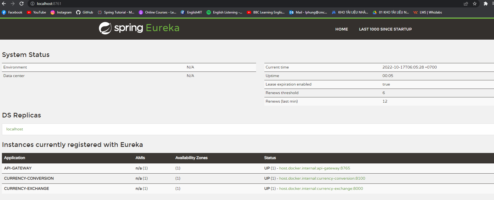
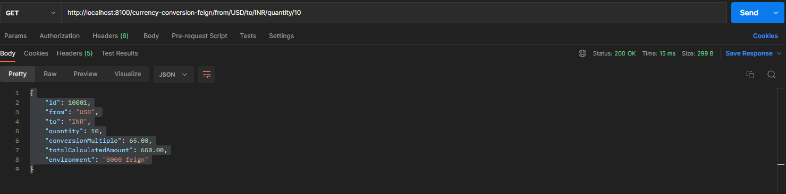
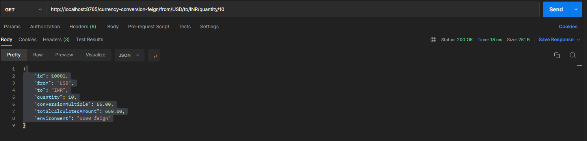
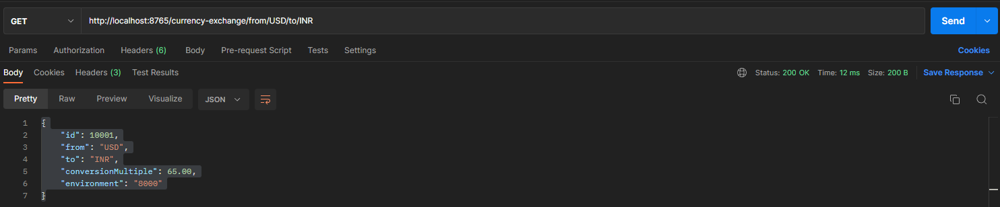
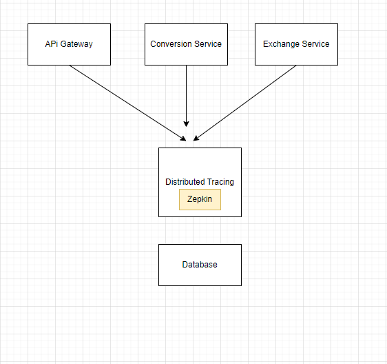
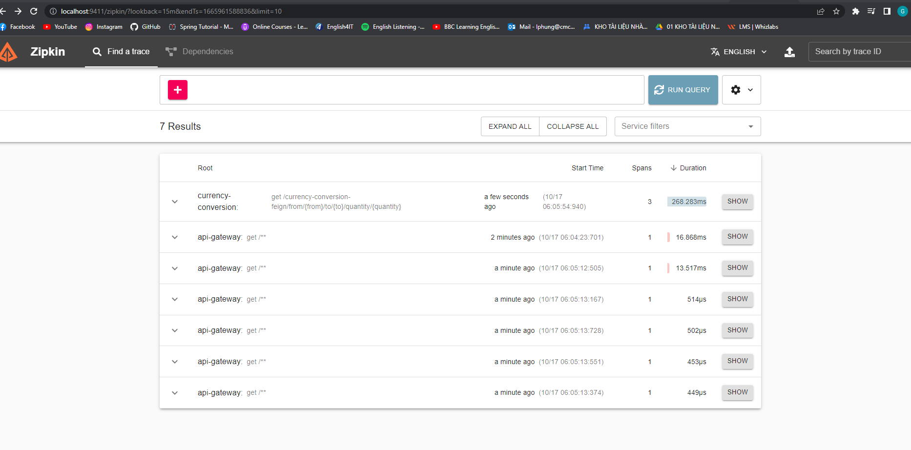
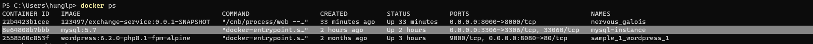
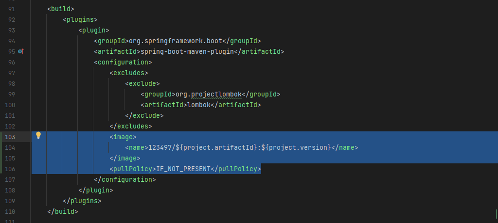
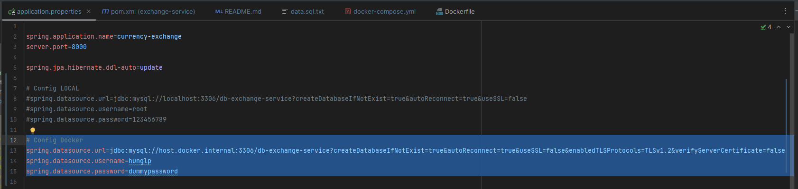
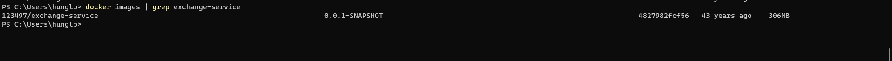

🔥🔥🔥🔥🔥🔥🔥🔥🔥🔥

**Mục lục**
   - [ **Phần 1: Microservices**]()
   - [ **Phần 2 : Tracing  (có thể bỏ qua phần này)**]()
   - [ **Phần 3 : Run docker microservices**]()

🔥🔥🔥🔥🔥🔥🔥🔥🔥🔥

[ **Phần 1: Microservices**]()

Check các service đã đăng kí trên Eureka(localhost:8761)

2. Tạo một Service "naming server", Sau đó dùng FeinClients để gọi service khác:

3. Tạo API Gateway (PORT 8765) có tác dụng điều hướng request tới các service

    Conversion:

    Exchange:

Database: File data.sql

----------------------------------------------------------------------------------------------------------

[ **Phần 2 : Tracing  (có thể bỏ qua phần này)**]()

Trong quá trình phát triển và vận hành một hệ thống, để giải quyết các vấn đề phát sinh,ta thường phải theo dõi 
flow của các request trong hệ thống. Flow của một request được bắt đầu kể từ khi hệ thống tiếp nhận request và kết thúc
khi hệ thống không còn xử lý request này nữa. Kỹ thuật này được gọi với thuật ngữ là tracing.

Thông qua distributed tracing, chúng ta có thể theo dõi được flow của một request dễ dàng hơn: xác định được tổng thời 
gian để hệ thống xử lý request đó, hoặc biết được request gặp vấn đề ở service nào.

Zipkin là một hệ thống distributed tracing open source. Chạy zipkin docker : `docker run -p 9411:9411 openzipkin/zipkin:latest`

Chạy zipkin: localhost:9411

Sau đó connect các service với zipkin bằng cách sau:

Thêm các dependency sau vào các file pom của services: conversion, exchange, naming-server, api-gateway
      
       <dependency>
            <groupId>org.springframework.cloud</groupId>
            <artifactId>spring-cloud-starter-sleuth</artifactId>
        </dependency>

        <dependency>
            <groupId>org.springframework.cloud</groupId>
            <artifactId>spring-cloud-sleuth-zipkin</artifactId>
        </dependency>

Trace được các request trên giao diện zipkin như hình:

------------------------------------------------------------------------------------------------------------------------
[**Phần 3 : Run docker microservices**]()

1. **Tạo network**

   `docker network create microservice_network`

2. **Mysql service**

    - Pull images mysql : `docker pull mysql:5.7`
    - Run container từ images vừa pull: 
   `docker run -e MYSQL_ROOT_PASSWORD=dummypassword -e MYSQL_DATABASE=db-exchange-service -e MYSQL_USER=hunglp -e MYSQL_PASSWORD=dummypassword --network microservice_network -p 3306:3306 --name=mysql-instance mysql:5.7`
    - Kết quả: 
    - Truy cập vào container mysql : `docker exec -it mysql-instance bash -l`
    - Đăng nhập mysql instance bằng lệnh :  `mysql -uroot -pdummypassword`
    - hiển thị list databases : `show databases;`
    - Sử dụng schema : `use db-exchange-service;`
    - Show tables cuar schema: `show tables;`
    - Query tables như bình thường :D

3. **Naming service**
   - cd tới _Naming-service_, Package file jar
   - Run file jar: docker run -p 8761:8761 --name naming-server --network currency-network naming-server-0.0.1-SNAPSHOT.jar

docker run -p 8761:8761 --name naming-server --network currency-network naming-server-0.0.1-SNAPSHOT.jar
docker run -p 8000:8000 --network=currency-network --name=exchange-service exchange-service/target/exchange-service-0.0.1-SNAPSHOT.jar

docker run -p 8100:8100 --network=currency-network --name=conversion-service conversion-service-0.0.1-SNAPSHOT.jar

docker run -p 8761:8761 --name naming-server --network currency-network naming-server-0.0.1-SNAPSHOT.jar

4. **Exchange-Service:**
    - Thêm vào file pom.xml như sau:
    - 
    - Apply config cho docker: 
    - cd tới thư mục exchange-services
    - Run lệnh sau để build images bằng maven: `./mvnw spring-boot:build-image -DskipTests`
    - Kiểm tra images vừa build: : `docker images | grep exchange-service`
    - Kết quả : 
    
    - Run container exchange-service : `docker run -p 8000:8000 123497/exchange-service:0.0.1-SNAPSHOT --name=exchange-instance --network microservice_network -d mysql-instance`

